# Edcleryton Silva (Eddie)

**QA Engineer | Test Automation Engineer | Web · Mobile · API**

---

## 📑 Sumário
- [📝 Sobre mim](#-sobre-mim)
- [🧰 Tecnologias e Ferramentas](#-tecnologias-e-ferramentas)
- [📈 Resultados e Impacto](#-resultados-e-impacto)
- [🚀 Projetos em Destaque](#-projetos-em-destaque)
- [📊 Estatísticas do GitHub](#-estatísticas-do-github)
- [🏅 Certificações & Cursos](#-certificações--cursos)
- [🌍 Idiomas](#-idiomas)
- [📫 Contato](#-contato)

---

## 📝 Sobre mim

Analista de QA com ~3 anos de experiência em testes manuais e automatizados para aplicações **web, mobile e APIs REST**. Iniciei como freelancer em plataformas de crowdtesting (uTest, Testio, Testerwork) em 2023, e desde então venho atuando em empresas de tecnologia e SaaS em ambientes ágeis (Scrum/Kanban).

Tenho experiência sólida em automação E2E com **Cypress, Selenium e Playwright**, testes de API com **Postman**, e exploração de automação mobile com **Maestro Studio** e **Robot Framework + Appium**. Gosto de construir qualidade desde o início, colaborar com devs e criar processos que tornam as entregas mais rápidas e confiáveis.

---

## 🧰 Tecnologias e Ferramentas

**Automação Web**

**Testes de API**

**Automação Mobile (POC)**

**CI/CD e Versionamento**

**Gestão e Colaboração**

**Outras Tecnologias**

---

## 📈 Resultados e Impacto

> Números reais das minhas entregas em projetos profissionais:

| Métrica | Resultado |
|---|---|
| 🧪 Cobertura de fluxos críticos (E2E) | **100%** |
| ⚡ Redução no tempo de regressão manual | **70%** |
| 🐛 Taxa de aceitação de bugs (Visie) | **99%** |
| 🐛 Taxa de aceitação de bugs (Pontotel) | **95%** |
| 🏗️ Suítes de automação construídas do zero | **2** |

---

## 🚀 Projetos em Destaque

- [**Scale-UX-Quality-Beedoo**](https://github.com/Edcleryton/DESAFIO-QA-BEEDOO-2026): Automação voltada para alta escalabilidade e UX crítica em plataformas de comunicação corporativa que atendem grandes players como Globoplay.
- [**Corporate-Data-Integrity-Challenge**](https://github.com/Edcleryton/betalent_chalenge): Validação de algoritmos complexos e integridade de dados utilizando **TypeScript**, garantindo a precisão em sistemas de psicometria.
- [**Security-Auth-Testing-Framework**](https://github.com/Edcleryton/autenticator_testes_automatizados): Framework focado em segurança, com manipulação rigorosa de **tokens JWT**, cookies e fluxos de autenticação para pesquisas cadastrais.
- [**Inventory-E2E-Automation-System**](https://github.com/Edcleryton/IJJ_PROJETO_FINAL_DE_CURSO): Automação End-to-End robusta com **Python** e **Selenium**, implementando o padrão **Page Object Model (POM)** para gestão de estoque.
- [**Agile-Process-Simulation**](https://github.com/Edcleryton/sprint_agil): Modelagem técnica de processos ágeis, simulando cerimônias de **Scrum**, estimativas e a cultura de qualidade dentro do ciclo de vida de software.
- [**Quality-Analysis-Bug-Reporting**](https://github.com/Edcleryton/mentoria_testes_desafio_03): Foco em documentação estratégica, análise de bugs e resolução de desafios técnicos em ecossistemas **JavaScript**.

---

## 📊 Estatísticas

  

---

## 🏅 Certificações & Cursos

- ✅ Postman API Fundamentals – Postman Academy
- ✅ Automação de Testes com Selenium – Udemy
- ✅ Accredited Software Testing Fundamentals – AICS®
- ✅ Qualidade de Software Básico e Avançado – Instituto Joga Junto
- ✅ Scrum Foundation – CertiProf
- ✅ Metodologias Ágeis – Digital Innovation One
- ✅ SQL – Curso em Vídeo

---

## 🌍 Idiomas

- 🇧🇷 Português: nativo
- 🇺🇸 Inglês: intermediário (leitura técnica e escrita profissional)
- 🇩🇪 Alemão: básico

---

## 📫 Contato

| | |
|:---:|:---|
|  | [linkedin.com/in/edcleryton-silva](https://www.linkedin.com/in/edcleryton-silva/) |
|  | [edcleryton.gabriel@gmail.com](mailto:edcleryton.gabriel@gmail.com) |
|  | (71) 9 9386-5329 |
